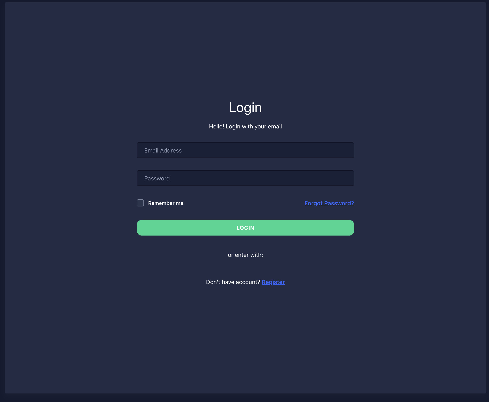

#### Setup:

```
git clone https://github.com/seanruggedcoastal/gatewayv2.git

cd gatewayv2

yarn install

yarn dev
```

#### Docker:

```
git clone https://github.com/seanruggedcoastal/gatewayv2.git

cd gatewayv2

docker build -t gatsby-admin-template

docker run --rm -d -p 80:80 gatsby-admin-template
```



